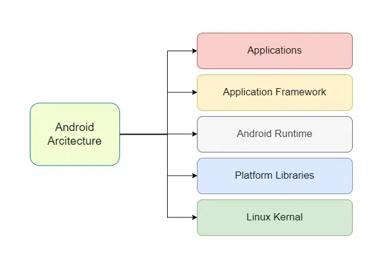
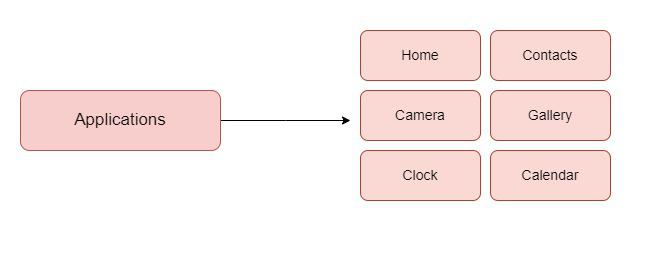
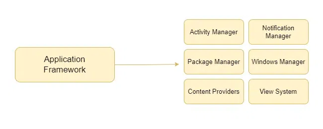
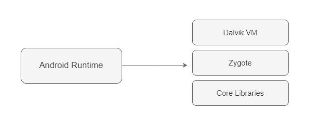
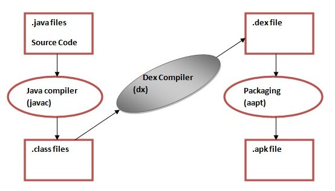
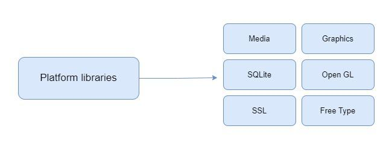
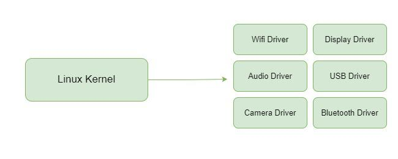

# Android Hacking Resources

# Android Architecture

## Applications
Top Layer of Android Architecture. Default apps like camera, call app and third party apps downloaded from play store belong to this layer. They run in the `Android Runtime` with the classes and services provided by the `Application Framework`

## Application Framework
They abstract hardware access and provide classes and services to build Android Applications

## Android Runtime
They contain core libraries and virtual machines like Java Virtual Machine(JVM) and Dalvik Virtual Machine(DVM). They create the base for `Application Framework` by providing core libraries. They depend on the `Linux Kernel` for low-level memory management. The core libraries enable us to build Android Applications using standard Java or Kotlin programming language

💡**Note:**

- Dalvik Virtual Machine (DVM): In earlier versions of Android (prior to Android 5.0 Lollipop), the DVM was used to execute DEX files. DVM is optimized for mobile devices and provides a lightweight environment for running Android applications. It uses Just-in-Time(JIT) Compilation

- Android Runtime (ART): Starting with Android 5.0, ART replaced DVM as the primary runtime environment. ART uses ahead-of-time (AOT) compilation, converting DEX files into native machine code during the installation process. This leads to improved performance, faster app startup times, and better memory management compared to DVM.

## Platform Libraries
The layer provides core C/C++ Libraries and Java Based Libraries like Media, Graphics, Surface Manager, OpenGL etc. to provide a support for android development.

 
 ## Linux Kernel
 Linux Kernel is heart of the android architecture. It manages all the available drivers such as display drivers, camera drivers, Bluetooth drivers, audio drivers, memory drivers, etc. which are required during the runtime. The Linux Kernel will provide an abstraction layer between the device hardware and the other components of android architecture. 

 

 # Android App Components
 
 - AndroidManifest.xml: It consists of the Application’s package name, build version, access rights details, referenced libraries, and other metadata in binary XML format.

- classes.dex: These are the classes compiled in .dex file format understandable by Dalvik VM.

- resources.arsc: These are the precompiled resources.

- res/ folder: These are the resources that could not be compiled into resources.arsc.

- lib/ folder: It consists of compiled code for native implementation.

- assets/ folder: These are the application’s assets.

